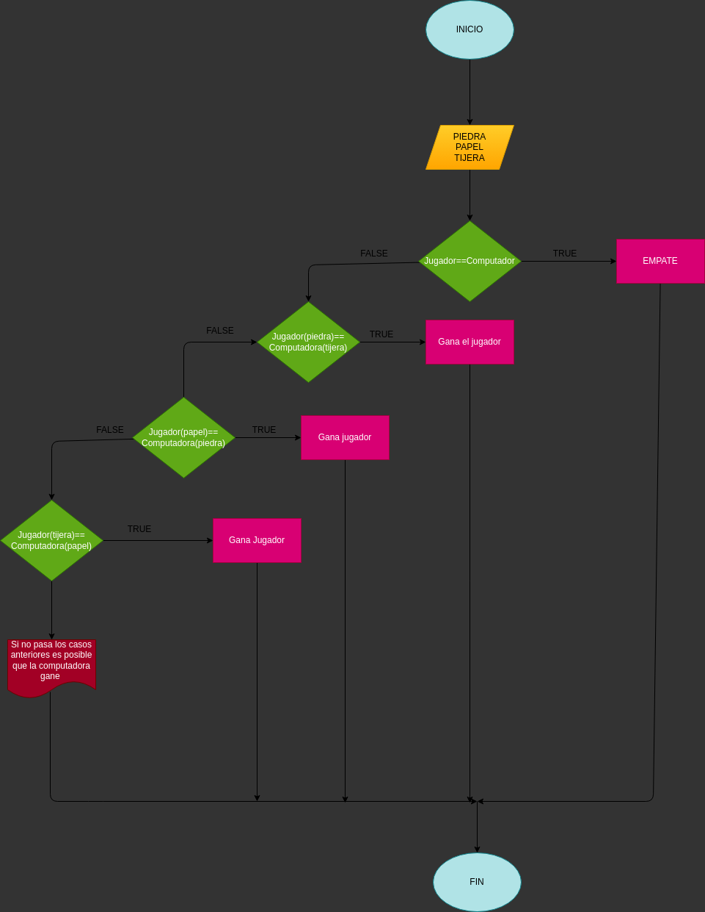

# Piedra_Papel_Tijera
Juego de piedra,papel y tijera

# ANALISIS

Entrada (input)

Piedra

Papel

Tijera

Proceso(processing)

Jugador escoje igual a el compuatdor

Jugador piedra y computador tijera; jugador tijera y computador papel; jugador papel y computadora piedra

Jugador piedra y computador papel; jugador tijera y computador piedra; jugador papel y computador tijera

SALIDA

Empate

Ganaste

Perdiste

# DISEÑO

# CONSTRUCCION

